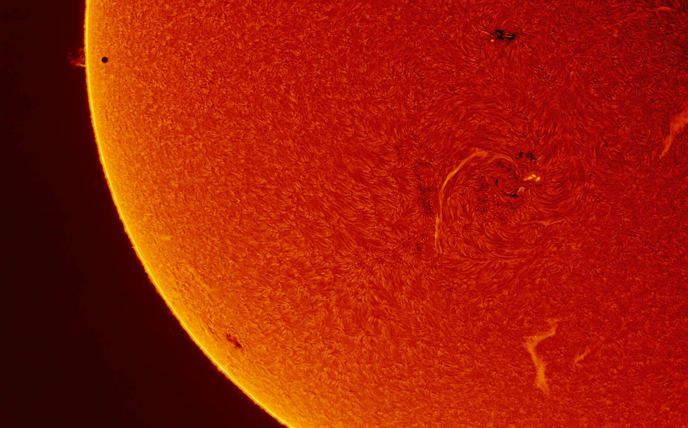

# Rep-1

<https://google.com>

**This is BOLD!**

_This is italic!_

~~This is struck?through~~

## H2 Sized Header!

#### H4 Sized Header!


I've always enjoyed
>block quotes.

* Bulleted
* Lists
* Are
* Great.

1. As
2. Are
3. Numbered
4. Lists.

```javascript
<button type="button"
onclick="document.getElementById('demo').innerHTML = Date()">
Click me to display Date and Time.</button>
```
| A | Simple | 3 |
|---|:------:|---|
| Column | Table | : ) |

___
This text is under the horizontal rule!

[This should link to the other file](second.md)

Image in my directory: 


I believe this concludes my Markdown Challenge, thanks! - Ethan Cain
